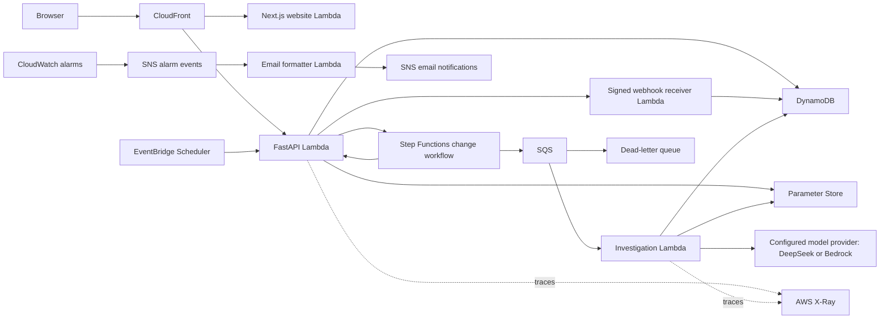

# Architecture and reliability

Switchboard separates evidence gathering from permission to change a customer's configuration. The AI investigator can read authorized records and recommend a change. Approval, execution, and delivery verification are deterministic application operations.

## Request flow

The website runs Next.js through AWS Lambda Web Adapter. Mangum adapts HTTP events to the existing FastAPI routes. The controlled receiver accepts signed HTTP deliveries and stores its own receipts. The worker handles SQS events directly; it does not run an HTTP server. Scheduler invokes an internal maintenance event, separate from public API routes.

CloudFront routes `/api/*` to the API and other paths to the website. Both Function URLs require AWS IAM authentication and Origin Access Control. HTML, API responses, and Next.js navigation responses are uncached; fingerprinted static assets are cached. Application tokens use a separate header from CloudFront's infrastructure signature. Mutation bodies include a SHA-256 digest; browser code contains no AWS credentials.

## Investigation

The LangGraph workflow carries employee identity, storage, and trusted time outside model-facing arguments. Its tools retrieve tickets, customers, integrations, and policies by ID. Each tool checks current employee roles and customer assignments before returning data.

The public demo uses the direct DeepSeek API. The optional Bedrock provider supports `deepseek.v3.2` and `openai.gpt-6-luna` through IAM-signed Mantle Chat Completions requests. The worker role can create inference only in this account's default project, restricted to those model IDs and the standard service tier; the website and API receive no model permissions. Provider and model selection are explicit. Provider failures remain failures and follow the existing queue retry policy; there is no automatic fallback.

The model returns a Pydantic-validated report with findings, decision criteria, blockers, and evidence references. A separate model call checks the report against the retrieved policies. One revision is allowed; a report that still fails validation is not published. Approval requirements are represented as later-stage conditions rather than confused with proposal blockers.

Validated output is checkpointed before deterministic proposal publication. The application validates the proposed customer, environment, destination, requester, and configuration snapshot against current records. Captured evidence remains attached to the saved investigation, so the UI can distinguish what the agent saw from later configuration changes.

Key implementation: [workflow](../backend/switchboard/investigation/workflow.py), [tools](../backend/switchboard/investigation/tools.py), [report validation](../backend/switchboard/investigation/report_validation.py), and [proposal validation](../backend/switchboard/proposals.py).

## Business actions

A production proposal requires approval from a different technical lead assigned to its customer. Execution rechecks the actor, approval, change window, and configuration version. The integration update and execution receipt commit in one transaction. A repeat returns the existing receipt instead of changing the configuration again.

Verification checks that the executed endpoint and version remain active, then sends a signed synthetic event to the separate receiver Lambda. The destination must belong to the configured receiver; redirects and unrelated hosts are rejected. The receiver persists one receipt per event ID. The client checks the destination, event ID, and payload hash before reporting delivery. A timeout remains inconclusive even if the event may have arrived. The verification receipt and ticket outcome commit together. Successful verification closes the request; failure or uncertainty requires manual intervention. Automatic rollback is not authorized by the current proposal model.

Key implementation: [change management](../backend/switchboard/change_management.py), [delivery verification](../backend/switchboard/delivery_verification.py), and [workflow status](../backend/switchboard/workflow_status.py).

## Durable jobs

The API authorizes the ticket, then atomically saves a job, idempotency lookup, and active-job marker before starting a named Step Functions execution. A failed start leaves recoverable work. Retrying the same request attempts dispatch again; scheduled maintenance also recovers pending submissions.

Step Functions sends the investigation to SQS with a callback token. The worker acknowledges the workflow after saving a completed result or a permanent failure. Production proposals wait for independent approval; all proposals then wait for explicit execution and delivery verification. Private callback tokens are stored separately from public reports. Callbacks use saved receipts, so an action committed before wait registration still advances. Hourly maintenance recovers callbacks lost after a business action. Executions have a 24-hour limit and stop for manual intervention on unconfirmed delivery. Step Functions coordinates stages; the existing application checks still authorize each action.

A worker claims a lease beyond its invocation deadline. Writes check the lease owner, workspace generation, and current business access. An active duplicate does not start another investigation; terminal duplicates return without model calls. Transient failures use SQS retries. Permanent access, input, or output failures become durable failed jobs.

Saved validated output can be reused after a publication failure. A crash before that checkpoint can still repeat model calls. Queue delivery is at least once; the application makes business effects idempotent rather than claiming exactly-once execution.

Dead-letter maintenance saves failure state before removing the message and never replaces a completed result. It also cleans expired workspaces and retired generations. Browser polling stops at completed or failed states, and run URLs restore progress after reload.

Key implementation: [outer workflow](../backend/switchboard/workflow.py), [jobs](../backend/switchboard/jobs.py), [maintenance](../backend/switchboard/maintenance.py), and [deadline handling](../backend/switchboard/investigation/deadline.py).

## Data and identity

Each workspace has an active generation. Business records use that workspace/generation partition with typed sort keys. Reset stages a complete set of records before publishing a new generation; older requests and workers cannot write into it.

Conditional transactions keep proposals and deduplication pointers together, prevent stale configuration writes, and publish job completion with its result and history. Large results use immutable chunks; readers see a completed manifest only after all chunks are saved. Browser queries use keyed reads rather than table scans. Scheduled cleanup uses bounded scans appropriate to this demo's scale.

Anonymous visitors receive Secure, HttpOnly, SameSite cookies and isolated workspaces with a sliding 24-hour lifetime. The persona selector changes the fictional employee being simulated; it does not bypass server authorization. Microsoft Entra mode validates tenant, audience, delegated scope, client, timestamps, and the employee mapping. Supplying a bearer token together with a demo persona is rejected.

Key implementation: [DynamoDB operations](../backend/switchboard/dynamodb.py), [request context](../backend/switchboard/api/context.py), and [authentication](../backend/switchboard/auth.py).

## Configuration and infrastructure

CloudFormation defines the hosting and protected origins, CloudFront subscription, queues and worker connection, hourly schedule, state machine, shared configuration parameter, and monitoring. Code releases publish immutable versions; the receiver alias is promoted through a stack parameter. API, worker, and website aliases support independent application releases.

Runtime settings come from a cached Standard Parameter Store entry. The worker obtains its direct-provider credential from a separate SecureString parameter encrypted with the AWS-managed SSM key. API, website, and receiver roles cannot read that credential. SecureString is supplied separately because CloudFormation does not support creating that parameter type. Values are refreshed when a new function version starts.

## Observability

CloudWatch retains structured logs for seven days and supplies a dashboard for Lambda, Step Functions, SQS, DynamoDB, Bedrock, and failed investigations. Standard alarms notify an SNS topic about function errors, sustained queue age, dead-letter messages, and permanently rejected investigations, failed workflows, and workflow timeouts. A policy-blocked investigation is a successful report, not an operational failure. An internal SNS topic delivers alarm events to a small Lambda that creates readable email subjects and explanations, timestamps, and investigation links. It publishes only to the existing email topic. Email subscriptions require SNS confirmation.

All functions enable sampled Lambda tracing. API, receiver, and worker functions use the pinned AWS Distro for OpenTelemetry Python layer to trace Lambda entry points and AWS SDK calls. This includes DynamoDB operations and SQS dispatch and processing. Metadata-only spans measure investigation model calls, policy reviews, report revisions, and IAM-signed Bedrock requests. The website uses Lambda invocation tracing. Generic HTTP instrumentation is disabled; model prompts, responses, credentials, and customer records are not added to trace attributes.

## Scope

The demo demonstrates live model investigation and a complete controlled business workflow over synthetic data. Delivery is real HTTP between controlled AWS resources; the customer systems and payloads remain synthetic. It does not establish production customer integration, an operator-success rate, or general model accuracy. Deterministic tests, live scenario checks, and deployed browser verification cover different parts of that contract.
